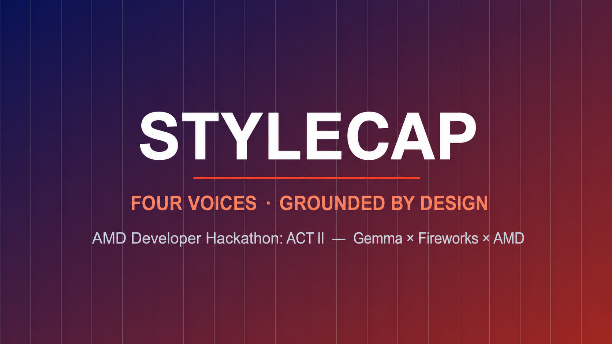

# StyleCap



StyleCap generates grounded captions for video clips in four requested voices:
`formal`, `sarcastic`, `humorous_tech`, and `humorous_non_tech`.

**Live demo:** https://stylecap-gemma.streamlit.app/

The evaluation path uses three model calls per clip:

1. Perceive sampled frames into a factual scene sheet.
2. Generate three candidates for every requested style in one batched call.
3. Select the most accurate, style-faithful candidate for each style in one batched call.

This compact path replaces the slower per-candidate judge loop and is designed for the
hackathon's 10-minute container limit and hidden set of approximately 12 clips.
The Docker image installs only `requirements-runtime.txt`; Streamlit and its analytics
dependencies remain outside the scoring image.

## Evaluator contract

The container reads `/input/tasks.json` on startup and writes `/output/results.json`
before exiting. Style IDs use underscores exactly as published in the participant guide.

Input:

```json
[
  {
    "task_id": "v1",
    "video_url": "https://example.com/clip.mp4",
    "styles": ["formal", "sarcastic", "humorous_tech", "humorous_non_tech"]
  }
]
```

Output:

```json
[
  {
    "task_id": "v1",
    "captions": {
      "formal": "...",
      "sarcastic": "...",
      "humorous_tech": "...",
      "humorous_non_tech": "..."
    }
  }
]
```

## Configuration

Never commit credentials. Copy `.env.example` for local development and set:

- `FIREWORKS_API_KEY`: your Fireworks API key.
- `STYLECAP_GEMMA_DEPLOYMENT`: the full on-demand endpoint returned by Fireworks,
  such as `accounts/<account>/deployments/<deployment>`. It powers perception,
  caption generation, and selection.
- `STYLECAP_PERCEPTION_MODEL`, `STYLECAP_STYLE_MODEL`, and
  `STYLECAP_JUDGE_MODELS`: optional experiment-only overrides.
- `STYLECAP_ENABLE_ASR=1`: optional local Whisper transcription. It is disabled by default to avoid cold-start downloads during evaluation.

The target base model is `accounts/fireworks/models/gemma-4-31b-it-nvfp4` with a
`GLOBAL` on-demand deployment. Its FP4 shape uses one B200 rather than the four-GPU
shape required by the unquantized 26B model. Use replicas `0-1` and a short
scale-to-zero window while developing. Warm one replica before latency-sensitive
judging because a scaled-to-zero deployment initially returns
`503 DEPLOYMENT_SCALING_UP`.

## Local verification

```powershell
python -m venv .venv
.\.venv\Scripts\python.exe -m pip install -r requirements.txt
.\.venv\Scripts\python.exe -m unittest discover -s tests -v
.\.venv\Scripts\python.exe run.py demo
```

Run the official file contract in mock mode:

```powershell
.\.venv\Scripts\python.exe run.py evaluate --mock --input examples/tasks.json --output out/results.json
```

Run the Streamlit demo:

```powershell
.\.venv\Scripts\python.exe -m streamlit run app.py
```

The public Streamlit deployment includes the system `ffmpeg` package required for
uploaded video decoding. Live inference may take roughly one minute on the first request
while the dedicated Fireworks replica scales from zero; subsequent requests are warm.

## Docker

Build the required Linux AMD64 image:

```bash
docker buildx build --platform linux/amd64 -t ghcr.io/georgexxe/stylecap:latest --push .
```

Local evaluator run:

```bash
docker run --rm \
  -e FIREWORKS_API_KEY \
  -e STYLECAP_GEMMA_DEPLOYMENT \
  -v "$PWD/input:/input:ro" \
  -v "$PWD/output:/output" \
  ghcr.io/georgexxe/stylecap:latest
```

## Repository layout

- `src/evaluator.py`: published Track 2 input/output contract.
- `src/ingest.py`: bounded URL download, frame extraction, and optional ASR.
- `src/perceive.py`: grounded fact-sheet extraction.
- `src/compact.py`: two-call batched caption generation and selection.
- `app.py`: Streamlit demo using the production pipeline.
- `tests/`: contract, download, selection, and pipeline tests.

## License

MIT
